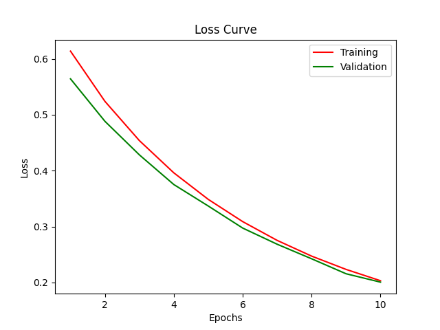
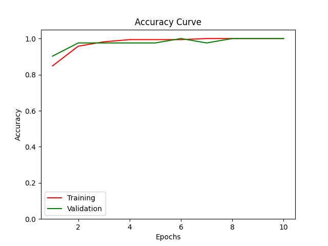

# Kerax

Keras-like APIs for the [JAX](https://github.com/google/jax) library.

## Features

* Enables high-performance machine learning research.
* Built-in support of popular optimization algorithms and activation functions.
* Runs seamlessly on CPU, GPU and even TPU! without any manual configuration required.

## Quickstart

### Code

```python3
from kerax.datasets import binary_tiny_mnist
from kerax.layers import Dense, Relu, Sigmoid
from kerax.losses import BCELoss
from kerax.metrics import binary_accuracy
from kerax.models import Sequential
from kerax.optimizers import SGD

data = binary_tiny_mnist.load_dataset(batch_size=200)
model = Sequential([Dense(100), Relu, Dense(1), Sigmoid])
model.compile(loss=BCELoss, optimizer=SGD(step_size=0.003), metrics=[binary_accuracy])
model.fit(data=data, epochs=10)
model.save(file_name="model")

interp = model.get_interpretation()
interp.plot_losses()
interp.plot_accuracy()
```
### Output

```terminal
WARNING:absl:No GPU/TPU found, falling back to CPU. (Set TF_CPP_MIN_LOG_LEVEL=0 and rerun for more info.)
Epoch 10: 100%|██████████| 10/10 [00:02<00:00,  3.82it/s, train_loss : 0.192 :: valid_loss : 0.202 :: train_binary_accuracy : 1.000 :: valid_binary_accuracy : 1.000]

Process finished with exit code 0
```




## Documentation (Coming soon...)

## Developer's Notes

This project is developed and maintained by [Umang Patel](https://github.com/umangjpatel)