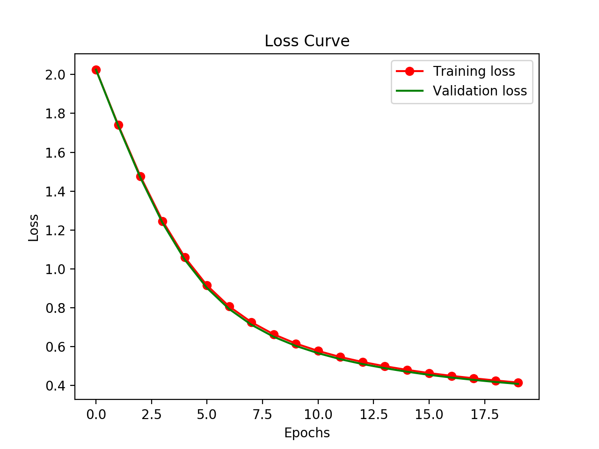
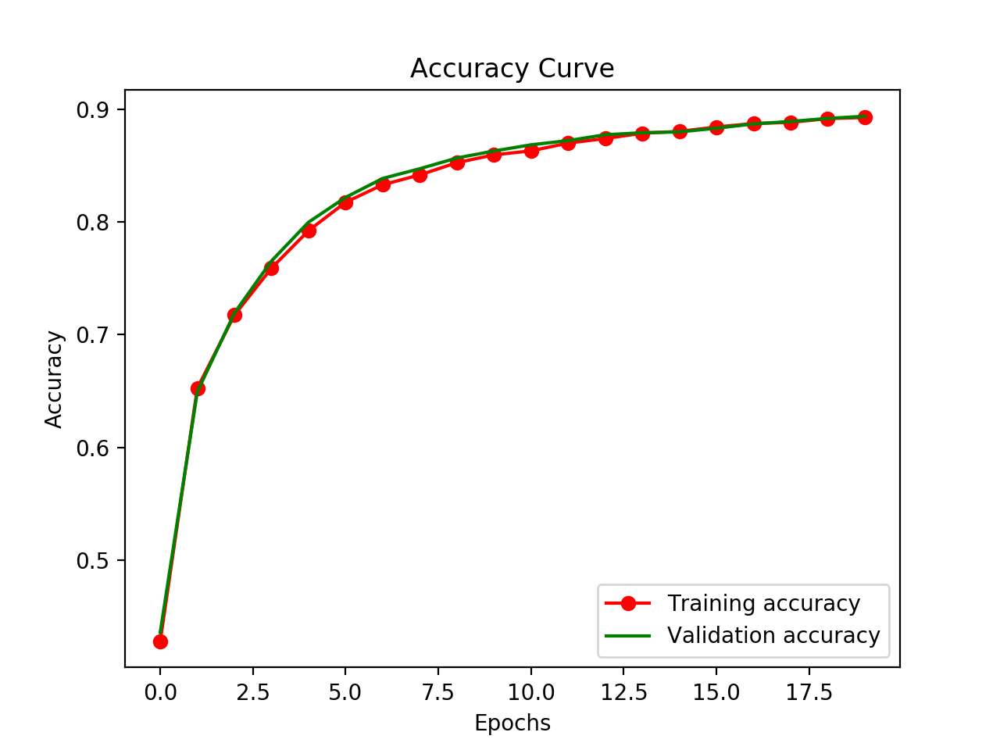
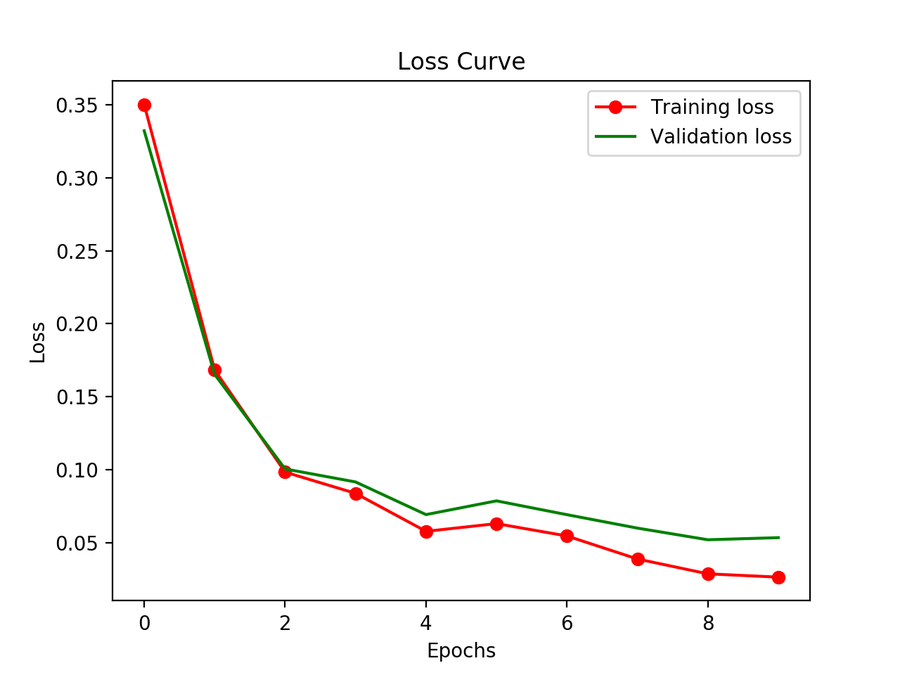
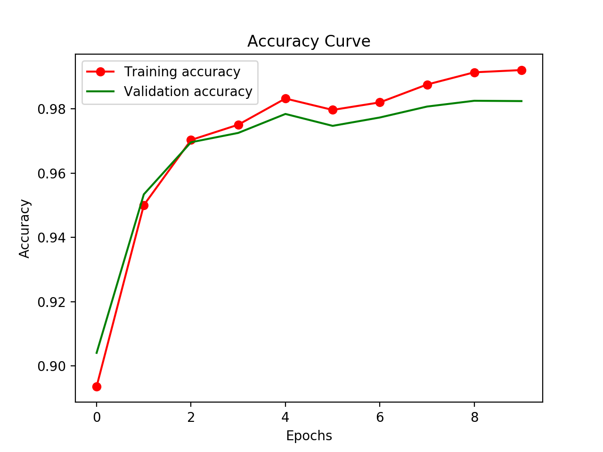

# Kerax (Undergoing v2 rewrite)

Check v2-rewrite branch

Neural Network Library written in Python and built on top of JAX, an open-source high-performance automatic differentiation library.

## Packages used

* [JAX](https://github.com/google/jax) for automatic differentiation.
* [Mypy](https://github.com/python/mypy) for static typing Python3 code.
* [Matplotlib](https://github.com/matplotlib/matplotlib) for plotting.
* [Pandas](https://github.com/pandas-dev/pandas) for data analysis / manipulation.
* [tqdm](https://github.com/tqdm/tqdm) for displaying progress bar.
* [NumPy](https://github.com/numpy/numpy) for randomization.

## Features

* Enables high-performance machine learning research.
* Supports FFNN and CNN models.
* Built-in support of popular optimization algorithms and activation functions.
* Easy to use with high-level Keras-like APIs.
* Runs seamlessly on CPU, GPU and even TPU! without any configuration required.

## Examples

### Tiny MNIST Fully-connected neural network (FFNN)

#### Code

```python3
from kerax import datasets
from kerax.layers import FC
from kerax.models import Sequential

(x_train, y_train), (x_val, y_val) = datasets.tiny_mnist(flatten=True, one_hot_encoding=True)

model = Sequential()
model.add(FC(units=500, activation="relu"))
model.add(FC(units=50, activation="relu"))
model.add(FC(units=1, activation="sigmoid"))
model.compile(loss="binary_crossentropy", optimizer="momentum", lr=1e-03, bs=128)
model.fit(inputs=x_train, targets=y_train, epochs=20, validation_data=(x_val, y_val))

model.plot_losses()
model.plot_accuracy()
```

#### Output

```terminal
/Library/Frameworks/Python.framework/Versions/3.7/lib/python3.7/site-packages/jax/lib/xla_bridge.py:119: UserWarning: No GPU/TPU found, falling back to CPU.
  warnings.warn('No GPU/TPU found, falling back to CPU.')
Epoch 20, Batch 40: 100%|██████████| 20/20 [00:15<00:00,  1.30it/s, Validation accuracy => 0.8935999870300293]

Process finished with exit code 0
```




### Tiny MNIST Convolutional neural network (CNN)

#### Code

```python3
from kerax import datasets
from kerax.layers import Conv2D, MaxPool2D, Flatten, FC
from kerax.models import Sequential

(x_train, y_train), (x_val, y_val) = datasets.tiny_mnist(flatten=False, one_hot_encoding=True)

model = Sequential()
model.add(Conv2D(filters=6, kernel_size=(5, 5), activation="relu"))
model.add(MaxPool2D(pool_size=(2, 2)))
model.add(Conv2D(filters=16, kernel_size=(5, 5), activation="relu"))
model.add(MaxPool2D(pool_size=(2, 2)))
model.add(Flatten())
model.add(FC(units=120, activation="relu"))
model.add(FC(units=84, activation="relu"))
model.add(FC(units=1, activation="sigmoid"))
model.compile(loss="binary_crossentropy", optimizer="sgd", lr=1e-03, bs=32)
model.fit(inputs=x_train, targets=y_train, epochs=10, validation_data=(x_val, y_val))

model.plot_losses()
model.plot_accuracy()
```

#### Output

```
/Library/Frameworks/Python.framework/Versions/3.7/lib/python3.7/site-packages/jax/lib/xla_bridge.py:119: UserWarning: No GPU/TPU found, falling back to CPU.
  warnings.warn('No GPU/TPU found, falling back to CPU.')
Epoch 10, Batch 40: 100%|██████████| 10/10 [01:41<00:00, 10.17s/it, Validation accuracy => 0.9824000000953674]

Process finished with exit code 0
```




## Roadmap

Check the [roadmap](https://github.com/umangjpatel/kerax/projects/2) of this project. This will show you the progress in
the development of this library.

## Developers

* [Umang Patel](https://github.com/umangjpatel)