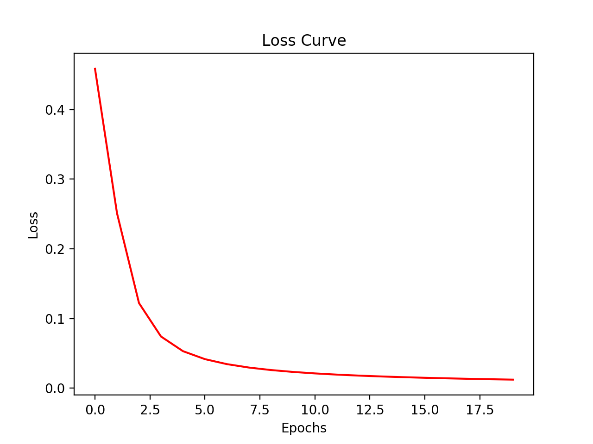
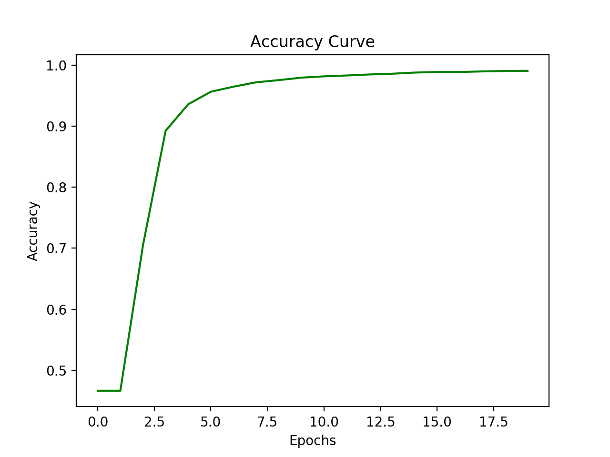
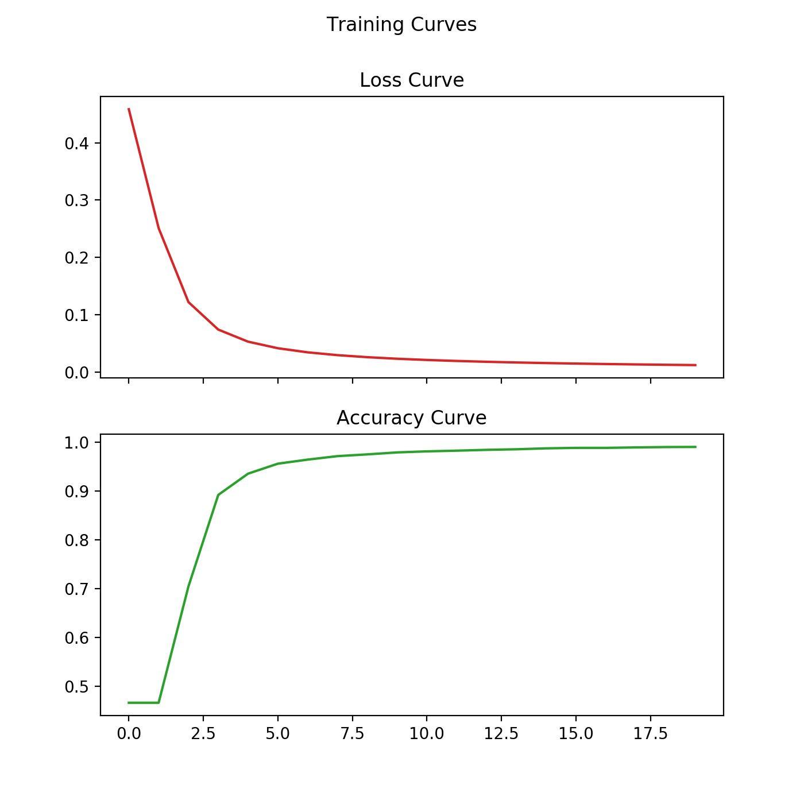

# DNet
Neural Network Library written in Python and built on top of JAX, an open-source high-performance machine learning library.

## Packages used
* [JAX](https://github.com/google/jax) for automatic differentiation.
* [Mypy](https://github.com/python/mypy) for static typing Python3 code.
* [Matplotlib](https://github.com/matplotlib/matplotlib) for plotting.
* [Pandas](https://github.com/pandas-dev/pandas) for data analysis / manipulation.

## Features
* Enables high-performance machine learning research.
* Easy to use with high-level APIs.
* Runs seamlessly on GPUs and even TPUs.

## Getting started

Here's the Sequential model :
```python3
model = Sequential()
```
Add the fully-connected layers / densely-connected layers :
```python3
model.add(FC(units=500, activation="relu"))
model.add(FC(units=50, activation="mish"))
model.add(FC(units=1, activation="sigmoid"))
```
Compile the model with the hyperparameters :
```python3
model.compile(loss="binary_crossentropy", epochs=20, lr=0.01)
```
Train the model :
```python3
model.fit(x_train, y_train)
```
Plot the loss curve :
```python3
model.plot_losses()
```
Plot the accuracy curve :
```python3
model.plot_accuracy()
```
Plot both the loss and accuracy curves :
```python3
model.plot_curves()
```
Compute scores :
```python3
train_score = model.evaluate(x_train, y_train)
print("Training accuracy : {0:.6f}".format(train_score))
val_score = model.evaluate(x_val, y_val)
print("Validation accuracy : {0:.6f}".format(val_score))
```

## Toy Example

### Code
```python3
import os

import jax.numpy as tensor
import pandas as pd

from dnet.layers import FC
from dnet.nn import Sequential

mnist_dataset_path = os.path.join("datasets", "mnist")
mnist_train_path = os.path.join(mnist_dataset_path, "mnist_train_small.csv")
mnist_test_path = os.path.join(mnist_dataset_path, "mnist_test.csv")

training_data = pd.read_csv(mnist_train_path, header=None)
training_data = training_data.loc[training_data[0].isin([0, 1])]

y_train = tensor.array(training_data[0].values.reshape(1, -1))  # shape : (1, m)
x_train = tensor.array(training_data.iloc[:, 1:].values.T)  # shape = (n, m)

testing_data = pd.read_csv(mnist_test_path, header=None)
testing_data = testing_data.loc[testing_data[0].isin([0, 1])]

y_val = tensor.array(testing_data[0].values.reshape(1, -1))  # shape : (1, m)
x_val = tensor.array(testing_data.iloc[:, 1:].values.T)  # shape = (n, m)

model = Sequential()
model.add(FC(units=500, activation="mish"))
model.add(FC(units=50, activation="mish"))
model.add(FC(units=1, activation="sigmoid"))
model.compile(loss="binary_crossentropy", epochs=20, lr=0.01)
model.fit(x_train, y_train)

model.plot_losses()
model.plot_accuracy()
model.plot_curves()

train_score = model.evaluate(x_train, y_train)
print("Training accuracy : {0:.6f}".format(train_score))
val_score = model.evaluate(x_val, y_val)
print("Validation accuracy : {0:.6f}".format(val_score))
```

### Outputs
```
/usr/local/bin/python3.7 DNet/test.py
/Library/Frameworks/Python.framework/Versions/3.7/lib/python3.7/site-packages/jax/lib/xla_bridge.py:115: UserWarning: No GPU/TPU found, falling back to CPU.
  warnings.warn('No GPU/TPU found, falling back to CPU.')
Training the model: 100%|██████████| 20/20 [00:03<00:00,  5.73it/s]
```



```
Training accuracy : 0.990488
Validation accuracy : 0.994326

Process finished with exit code 0
```


## Roadmap
Check the [roadmap](https://github.com/umangjpatel/dnet/projects/2) of this project. This will give you the idea of the progress in the development of this library.

## Developers
* [Umang Patel](https://github.com/umangjpatel)
