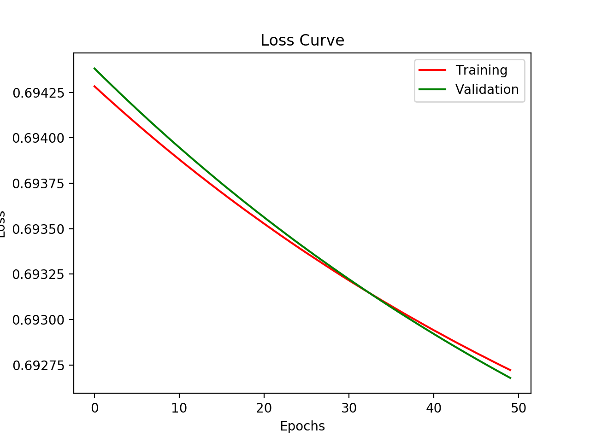

# DNet
Neural Network Library written in Python and built on top of PyTorch, an open-source high-performance deep learning library.

## Packages used
* [PyTorch](https://github.com/pytorch/pytorch) for automatic differentiation.
* [Mypy](https://github.com/python/mypy) for static typing Python3 code.
* [Matplotlib](https://github.com/matplotlib/matplotlib) for plotting.
* [Pandas](https://github.com/pandas-dev/pandas) for data analysis / manipulation.
* [tqdm](https://github.com/tqdm/tqdm) for displaying progress bar.

## Features
* Enables high-performance machine learning research.
* Easy to use with high-level Keras-like APIs.
* Runs seamlessly on GPU.

## Getting started

Here's the Sequential model :
```python3
net = Sequential()
```
Add the fully-connected layers / densely-connected layers :
```python3
net.add(FC(units=500, activation="relu"))
net.add(FC(units=50, activation="mish"))
net.add(FC(units=1, activation="sigmoid"))
```
Compile the model with the hyperparameters :
```python3
net.compile(loss="binary_crossentropy", epochs=20, lr=0.01)
```
Train the model :
```python3
net.fit(x_train, y_train)
```
Plot the loss curves :
```python3
net.plot_losses()
```

## Toy Example

### Code
```python3
import torch
import pandas as pd
from pathlib import Path

from dnet.nn import Sequential
from dnet.layers import FC

dataset_path = Path("datasets")
train_path = dataset_path / "mnist_small" / "mnist_train_small.csv"
test_path = dataset_path / "mnist_small" / "mnist_test.csv"

training_data = pd.read_csv(train_path, header=None)
training_data = training_data.loc[training_data[0].isin([0, 1])]

y_train = torch.from_numpy(training_data[0].values.reshape(1, -11))  # shape : (1. m)
x_train = torch.from_numpy(training_data.iloc[:, 1:].values.T) / 255.0  # shape = (n, m)

testing_data = pd.read_csv(test_path, header=None)
testing_data = testing_data.loc[testing_data[0].isin([0, 1])]

y_val = torch.from_numpy(testing_data[0].values.reshape(1, -1))  # shape : (1, m)
x_val = torch.from_numpy(testing_data.iloc[:, 1:].values.T) / 255.0  # shape = (n, m)

net = Sequential()
net.add(FC(units=500, activation="mish"))
net.add(FC(units=10, activation="relu"))
net.add(FC(units=1, activation="sigmoid"))
net.compile(optimizer="sgd", loss="binary_crossentropy", lr=1e-02)
net.fit(x_train, y_train, epochs=50, validation_data=(x_val, y_val))

net.plot_losses()
```

### Outputs
```
/usr/local/bin/python3.7 DNet/test.py
Using CPU for training...
Training your model : 100%|██████████| 50/50 [00:02<00:00, 20.49it/s]
```

```
Process finished with exit code 0
```


## Roadmap
Check the [roadmap](https://github.com/umangjpatel/dnet/projects/2) of this project. This will give you the idea of the progress in the development of this library.

## Developers
* [Umang Patel](https://github.com/umangjpatel)
